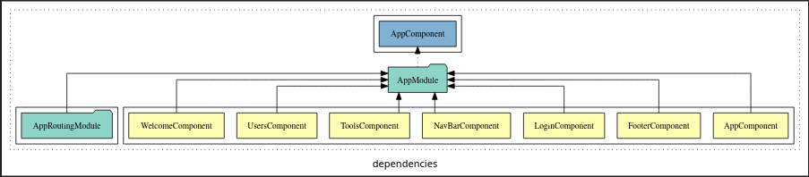
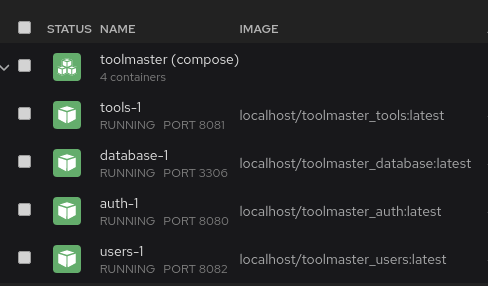
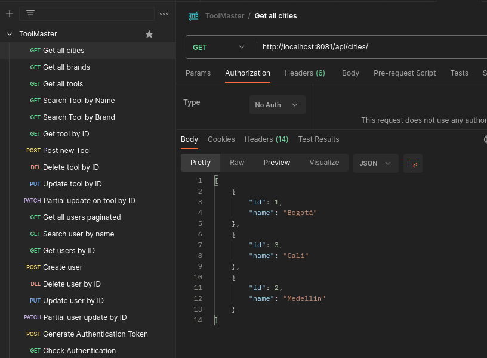
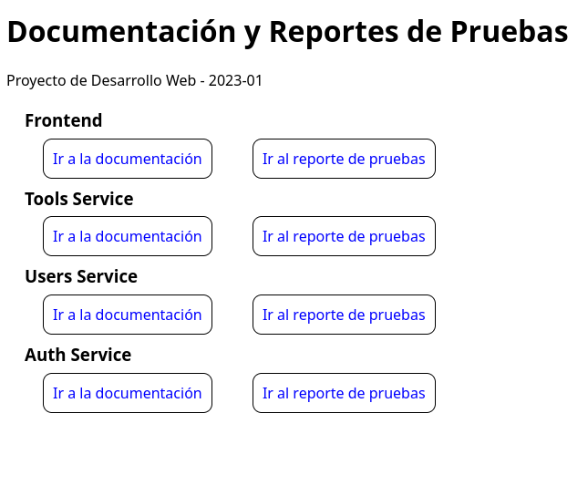

# 🔩 toolmaster

ToolMaster es un aplicativo web diseñado para el gremio de ferreterías a nivel nacional. Su objetivo principal es brindar una plataforma moderna y accesible que facilite la transformación digital de este sector.

A continuación se explican los detalles técnicos de la aplicación:

## Componentes
La arquitectura está dividida en microservicios, los servicios y sus dependencias son descritas en el siguiente diagrama:

### Frontend

El frontend se encuentra programado en _Angular 15_, para ejecutarlo dirígase al directorio [frontend](/frontend/), una vez aquí, ejecute los siguiente comandos para compilar el proyecto (Requiere una instalación de _npm_ y _angular_)

	npm i
	ng serve --open

De ser posible, cerciore que las pruebas unitarias son exitosas en su totalidad. Utilice el siguiente comando para ejecutarlas:

	ng test --code-coverage

Puede generar la documentación del proyecto a través del comando:

	npm compodoc

La arquitectura de la aplicación es mostrada a continuación:

### Backend

El _backend_ se encuentra dividido en 3 _microservicios_ todos programados en Java11

- AuthService: Microservicio encargado de proveer autenticación.
- UsersService: Microservicio encargado de proveer información sobre todos los usuarios.
- ToolsService: Microservicio encargado de gestionar todas las herramientas

___*__ Para ejecutar estos servicios es necesario una base de datos SQL_

Para ejecutar todos estos servicios se ha creado un archivo yaml con la configuración necesaria de _DockerCompose_ para generar cada uno de los contenedores

Para iniciarlo ejecute los siguientes comandos (Requiere docker y docker-compose o compatibles):

	docker-compose up -d

Esto generará los siguiente contenedores:

Para probar la API de los servicios, importe la colección de postman que puede ser encontrada en el directorio raíz del proyecto:

## Documentación

Para ver la documentación asociada a cada uno de los componentes abra el archivo [index.html](./docs/documentacion/index.html) en el navegador, se abrirá una ventana como esta:

En la que podrá consultar la documentación y reporte de pruebas de cada uno de los componentes.