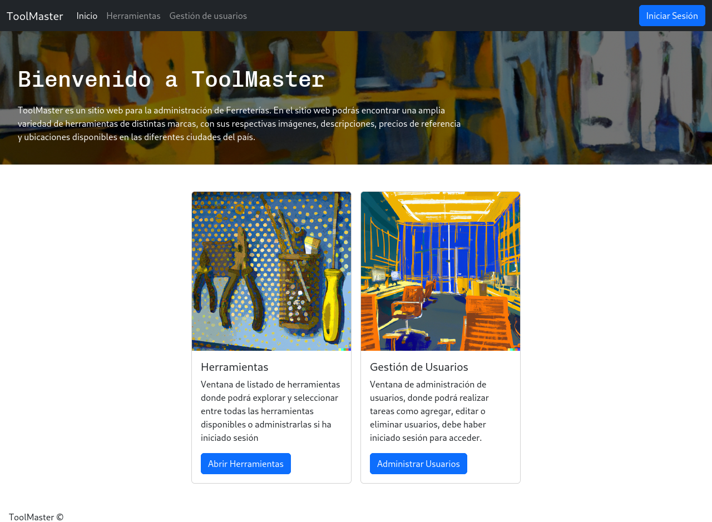

# Manual de Usuario para Toolmaster

## Página Principal
Al ingresar a Toolmaster, el usuario encontrará varias imágenes y botones. En la esquina superior derecha se ubica un botón para iniciar sesión. En la mitad de la página, hay dos botones principales: "Administrar Usuarios" y "Ver Herramientas".

### Ver Herramientas
El botón "Ver Herramientas"  llevará al usuario a una página con el listado completo de herramientas disponibles. Este listado es accesible para cualquier usuario, esté autenticado o no. 

En esta sección, el usuario tiene varias opciones para filtrar las herramientas:

| Screenshot                                          | Descripción                                                                                                         |
| --------------------------------------------------- | ------------------------------------------------------------------------------------------------------------------- |
|  | *Filtrar por Marca*: Al usuario seleccionar este botón, aparecerá el listado de marcas disponibles para que puedas escoger. |
|    | *Ordenar*: Este botón permite ordenar las herramientas por nombre, ciudad, precio o marca.                       |

### Iniciar Sesión
Para iniciar sesión, el usuario debe hacer clic en el botón "Iniciar Sesión" en la esquina superior derecha. El usuario será redirigido a una nueva página para ingresar su usuario y contraseña.

Si los datos de autenticación son correctos, el usuario será llevado de nuevo a la página principal. Ahora, el botón de iniciar sesión cambiará a "Cerrar Sesión". Debajo de este, aparecerá un mensaje de bienvenida con tu nombre.

### Administrar Usuarios
Una vez autenticado, el usuario podrá acceder al botón "Administrar Usuarios". Aquí podrá ver la información de los usuarios autenticados y desactivarlos.

Para facilitar la búsqueda de usuarios, hay varias opciones de filtro disponibles:

| Screenshot                                    | Descripción                                                                                                                                     |
| --------------------------------------------- | ----------------------------------------------------------------------------------------------------------------------------------------------- |
|  | *Ordenar por*: Este botón permite ordenar la lista de usuarios por nombre, apellido, número de identificación, fecha de nacimiento y ciudad. |

Si el usuario intenta acceder a esta sección sin estar autenticado, recibirá un mensaje de error que lo invita a iniciar sesión.

### Cerrar Sesión
Para cerrar la sesión, el usuario debe hacer clic en el botón "Cerrar Sesión", presente en todas las páginas una vez que has iniciado sesión. Será redirigido a una página donde se le pedirá confirmación para cerrar sesión.

## Créditos
Programación Web 2023-1
* Angel Talero
* Humberto Rueda